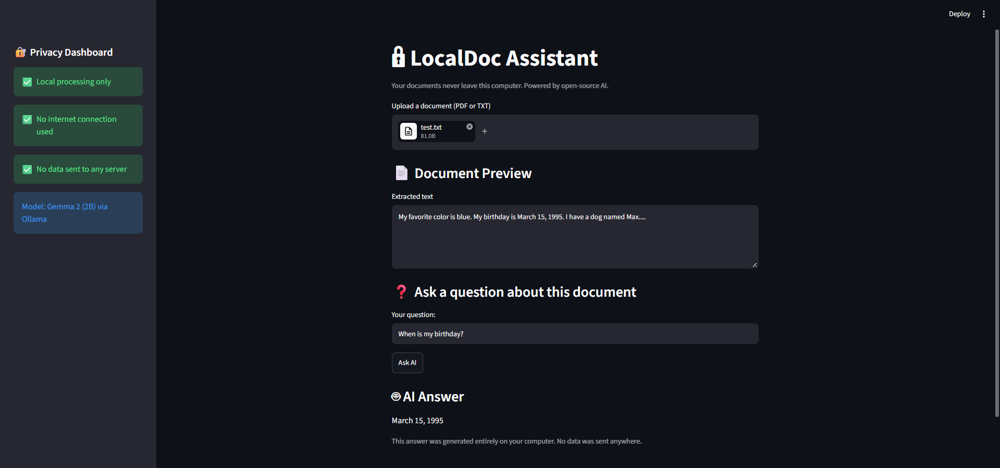

<!-- ═══════════════════════════════════════════════════════════════ -->
<!--                    🔒  LocalDoc Assistant                       -->
<!--          Built with ❤️ for Hacktoberfest 2026 Challenge         -->
<!-- ═══════════════════════════════════════════════════════════════ -->

<div align="center">

<!-- Hacktoberfest Hero Banner -->


<br /><br />

# 🔒 LocalDoc Assistant

### *Your documents. Your AI. Your computer. Nobody else's.*

**A private AI document assistant that runs 100% offline.**
Upload a PDF or TXT file, ask questions about it, and get answers —
**without a single byte leaving your computer.**

<br />

<!-- Hacktoberfest 2026 Challenge Banner -->
<a href="https://dev.to/challenges/hacktoberfest-weekend-2026-10-01">
  
</a>
<a href="https://dev.to/challenges/hacktoberfest-weekend-2026-10-01">
  
</a>
<a href="https://dev.to/challenges/hacktoberfest-weekend-2026-10-01">
  
</a>

<br /><br />

<!-- Tech Badges -->


<br />



<br />

[🎯 Challenge](#-hacktoberfest-2026-submission) · [💡 Why](#-why-i-built-this) · [✨ Features](#-features) · [🚀 Run It](#-how-to-run) · [🌍 Open AI](#-why-open-innovation-matters) · [📜 License](#-license)

</div>

---

<!-- ═══════════════════════════════════════════════════════════════ -->

<div align="center">

## 🎃 Hacktoberfest 2026 Submission

<table>
<tr>
<td align="center" width="33%">

### 🏆 Challenge
**Weekend Challenge**
<br />
*Build for a Friend*

</td>
<td align="center" width="33%">

### 🎨 Theme
**Build for a Friend**
<br />
*"Ship something that solves a real problem for a friend or someone you love."*

</td>
<td align="center" width="33%">

### 🥇 Category
**Best Use of Gemma**
<br />
*Google's open-weight model*

</td>
</tr>
</table>

<a href="https://dev.to/challenges/hacktoberfest-weekend-2026-10-01">
  
</a>

</div>

---

<!-- ═══════════════════════════════════════════════════════════════ -->

<div align="center">

## 💡 Why I Built This

</div>

> *"I can't upload client contracts to ChatGPT. It's a confidentiality thing."*
>
> — **My friend, a freelance lawyer**

My friend handles sensitive legal documents every day. She wanted AI to help her find information faster — but every cloud AI service meant sending confidential data to a server she doesn't control.

So I built her something better.

**LocalDoc Assistant** gives her AI-powered document search with **complete privacy**. The AI runs on her laptop. Nothing goes to the internet. Nothing gets logged. Nothing gets trained on. Just her, her documents, and an open-source model that respects both.

<div align="center">

```
   ┌─────────────────────────────────────────────────────┐
   │  🔒  Her documents  →  🧠  Her laptop's AI  →  💬  Answer  │
   │                                                     │
   │           ☁️  NOTHING EVER TOUCHES THE CLOUD  ☁️         │
   └─────────────────────────────────────────────────────┘
```

</div>

---

## ✨ Features

<table>
<tr>
<td width="50%" valign="top">

### 🔐 Radically Private
Your documents never leave your machine. No servers. No tracking. No telemetry. No nothing.

</td>
<td width="50%" valign="top">

### ⚡ Blazing Fast
Runs locally with Gemma 2 — no waiting on network round trips to a distant cloud API.

</td>
</tr>
<tr>
<td width="50%" valign="top">

### 💸 Free Forever
No API keys. No subscriptions. No per-token costs. Zero dollars, zero cents, zero limits.

</td>
<td width="50%" valign="top">

### 📄 PDF & TXT Support
Drop in contracts, notes, medical records, study material — anything text-based.

</td>
</tr>
<tr>
<td width="50%" valign="top">

### 🧠 Open-Weight AI
Powered by Google's Gemma 2. Swap it for any other model in one line of code.

</td>
<td width="50%" valign="top">

### 🎨 Simple UI
Built with Streamlit — clean, instant, and no setup for the person using it.

</td>
</tr>
</table>

---

## 🎬 Demo

<div align="center">


*The app correctly answers **"March 15, 1995"** from an uploaded text file — offline.*

</div>

---

## 🧰 Tech Stack

<div align="center">

| 🧩 Layer | 🛠️ Tool | 🎯 Purpose |
|:--------:|:-------:|:----------|
| **AI Runtime** | [Ollama](https://ollama.com) | Runs LLMs locally on any machine |
| **Model** | [Gemma 2 (2B)](https://ai.google.dev/gemma) | Google's open-weight model |
| **UI** | [Streamlit](https://streamlit.io) | Instant web interface in Python |
| **PDF Parsing** | [PyPDF2](https://pypi.org/project/PyPDF2/) | Extracts text from PDFs |
| **Language** | Python 3.9+ | Glues it all together |

</div>

---

## 🚀 How to Run

<div align="center">

### ⚡ From zero to running in under 5 minutes

</div>

### 1️⃣ Install Ollama
Download from **[ollama.com/download](https://ollama.com/download)** and install it.

### 2️⃣ Download the model
```bash
ollama pull gemma2:2b
```

### 3️⃣ Get the code
Click the green **Code** button above → **Download ZIP** → extract it.

*(Or, if you have Git:* `git clone https://github.com/vaibhav7549/localdoc-assistant.git`*)*

### 4️⃣ Install Python dependencies
```bash
pip install streamlit ollama PyPDF2
```

### 5️⃣ Run the app
```bash
python -m streamlit run app.py
```

<div align="center">

**That's it.** Your browser opens at `http://localhost:8501`.

*The first query may take 10–20 seconds while the model loads into memory. After that, it's instant.*

</div>

---

## 🕹️ How to Use

<div align="center">

```
┌─────────────────────────────────────────────┐
│                                             │
│  1.  📄  Upload a PDF or TXT file           │
│                                             │
│  2.  ❓  Ask a question about the document   │
│                                             │
│  3.  🤖  Click "Ask AI"                      │
│                                             │
│  4.  ✅  Read the answer — 100% locally      │
│                                             │
└─────────────────────────────────────────────┘
```

</div>

---

## 🌍 Why Open Innovation Matters

This project would be **impossible** with a closed API.

The entire point is privacy — my friend *cannot* upload client documents to a third-party server. Here's why open-source AI was the **only** way:

<div align="center">

| 🔒 Closed API | 🔓 Open-Source AI *(what I chose)* |
|:-------------|:----------------------------------|
| Data leaves your machine | Data **never leaves your machine** |
| Pay per token, forever | **Free** to run, forever |
| Fixed model, fixed behavior | **Swap models** with one line of code |
| Company can change terms overnight | **You own the stack** |
| Requires internet | **Works on a plane, in a cabin, offline** |

</div>

<br />

**Open innovation means the tool answers to the person using it — not the other way around.**

This is why Hacktoberfest 2026 matters: *"It's not about open source pull requests. There's no PR count to hit and no repos to hunt for. Instead, you build a brand-new project with open-source AI at its core."*

---

## 📁 Project Structure

```
localdoc-assistant/
│
├── 📄  app.py            # The Streamlit app + Ollama integration
├── 📘  README.md         # You are here
├── 🖼️  demo.png          # Screenshot of the app in action
├── ⚖️  LICENSE           # MIT — free to use, modify, share
└── 🚫  .gitignore        # Keeps venv/ out of the repo
```

---

## 🤝 Contributing

Ideas, bug reports, and pull requests are welcome — this is **Hacktoberfest**, after all! 🎃

1. Fork the repo
2. Create a branch: `git checkout -b feature/your-idea`
3. Commit: `git commit -m "Add your idea"`
4. Push: `git push origin feature/your-idea`
5. Open a Pull Request

If you build something cool on top of this, I'd love to hear about it.

---

## 🏆 Built For Hacktoberfest 2026

<div align="center">

<table>
<tr>
<td align="center">

### 🎃
**Hacktoberfest 2026**
<br />
*Weekend Challenge: Build for a Friend*

</td>
<td align="center">

### 📝
**DEV Community**
<br />
*Written up and submitted on dev.to*

</td>
<td align="center">

### 🥇
**Best Use of Gemma**
<br />
*Google's open-weight model*

</td>
</tr>
</table>

<br />

<a href="https://dev.to/challenges/hacktoberfest-weekend-2026-10-01">
  
</a>

</div>

---

## 📜 License

Released under the **MIT License** — see [LICENSE](LICENSE).

You're free to use, modify, distribute, and even sell it. Just keep the copyright notice.

---

<div align="center">

<br />

## ⭐ If this helped you, drop a star — it means a lot!

<br />

**Built with ❤️ for a friend who deserves better than the cloud.**

<br />

*Powered by open-source AI · Running entirely on your machine · Hacktoberfest 2026*

<br />

<a href="https://github.com/vaibhav7549/localdoc-assistant/stargazers">
  
</a>
<a href="https://github.com/vaibhav7549/localdoc-assistant/network/members">
  
</a>
<a href="https://github.com/vaibhav7549/localdoc-assistant/issues">
  
</a>

<br /><br />

```
   ╔══════════════════════════════════════════════════╗
   ║                                                  ║
   ║   🎃  Happy Hacktoberfest 2026  🎃               ║
   ║                                                  ║
   ║   "The best AI is the one that                   ║
   ║    answers to you — not to a server."            ║
   ║                                                  ║
   ╚══════════════════════════════════════════════════╝
```

<br />

<sub>Made with ❤️ and open-source AI · © 2026 Vaibhav</sub>

</div>
